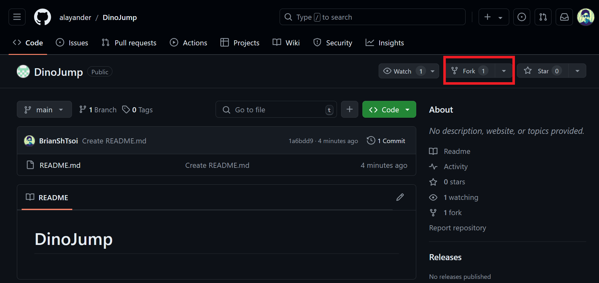
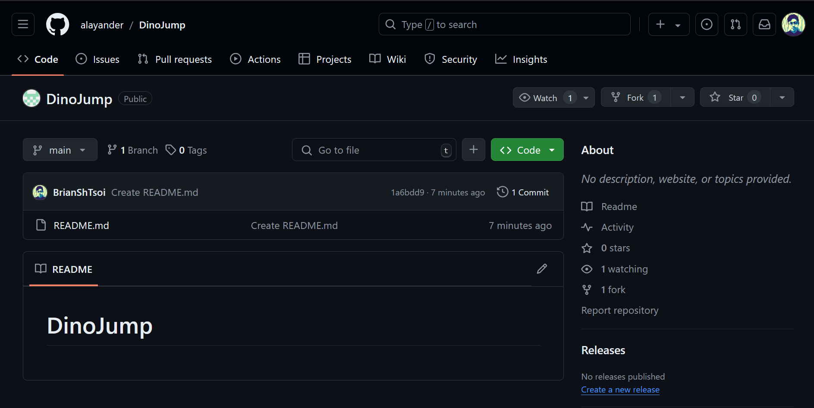
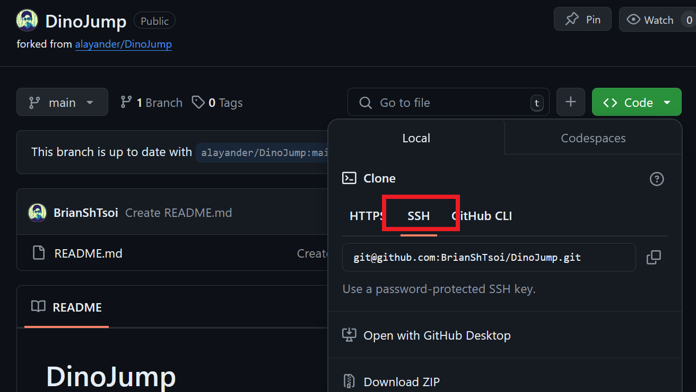
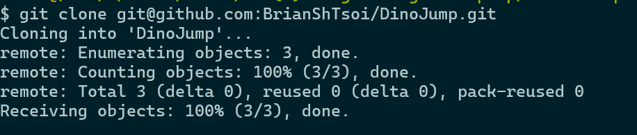
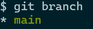
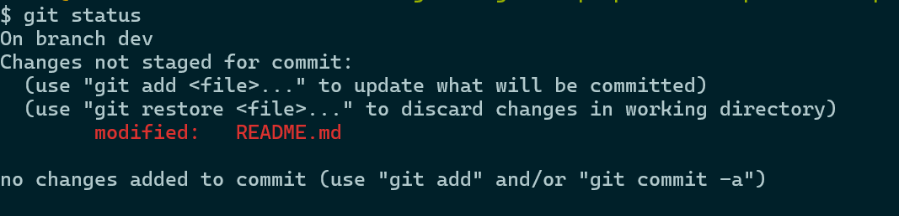
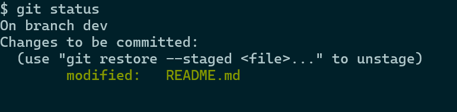
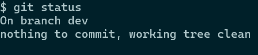
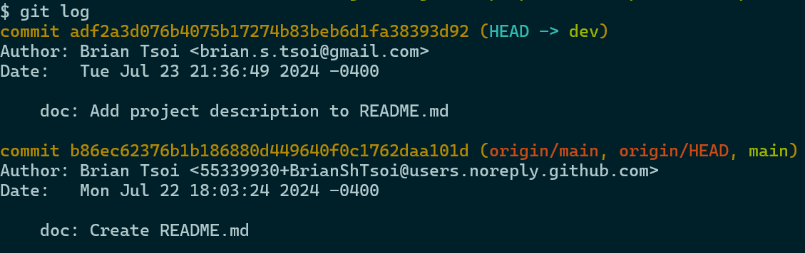
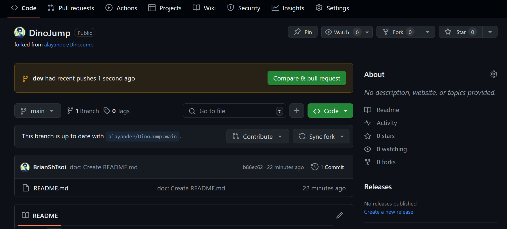

# spark-git-workshop

This workshop walks through the recommended Git/Github workflow for Spark projects, also commonly found in the industry and well-established open source projects.

## Prerequisites

* Install [git](https://git-scm.com/downloads)
* Git [username](https://docs.github.com/en/get-started/getting-started-with-git/setting-your-username-in-git) and [email](https://docs.github.com/en/account-and-profile/setting-up-and-managing-your-personal-account-on-github/managing-email-preferences/setting-your-commit-email-address) set up
* Have a [GitHub](https://github.com/) account
* GitHub account is connected to your machine with ssh
  * As cloning with ssh is suggested over [https](https://docs.github.com/en/get-started/getting-started-with-git/why-is-git-always-asking-for-my-password)
  * See links for [generating ssh key](https://docs.github.com/en/authentication/connecting-to-github-with-ssh/generating-a-new-ssh-key-and-adding-it-to-the-ssh-agent) (you can ignore all content below "Adding your SSH key to the ssh-agent") and [adding ssh key to GitHub](https://docs.github.com/en/authentication/connecting-to-github-with-ssh/adding-a-new-ssh-key-to-your-github-account)

## Now on with the actual content. 

Feel free to follow the steps and add your name to `Sparker.md`

## Fork the repository
Go to the main repository and click `Fork`. 


Then click `Create fork`. This forks the repo.

This should send you to your GitHub account’s copy of the main repo, which you just forked.


## Clone repository to local machine
On your account’s repo, click `Code` and `SSH` (It might default to HTTPS, do not use that)


Click the copy button to copy the link. Then open up your terminal (or Git Bash), use `cd` to navigate to the directory you want and use `git clone` to clone the repo, as shown below:
```
  cd path/to/desired/directory/
  git clone <copied link>
```

This should be the expected output:


Use the `ls` command and you should see a local copy of the repo.

## Make new branch
`cd` into the repo and enter `git branch` to show all branches of the local repo.
```
  cd spark-git-workshop
  git branch
```

Right now there is only `main`.


The `main` branch should track the commits in `origin/main` (i.e. the github repo we cloned from), and `origin/main` should track the commits in main repo we forked from, so we should not make changes on the `main` branch.

A common convention is to call the branch you work on `dev`. Create a new branch with
```
  git branch dev
```

This creates a new branch called `dev` (you can check by running `git branch` again), but we are still on `main`. 

We can move to a different branch with
```
git checkout <branch_name>
git checkout dev  # move to the dev branch
```
You can create and move to a new branch in one command with
```
git checkout -b <new_branch_name>
```
Now you are on a new branch and you can make whatever changes to develop and test your code.

## Make changes
Develop on your local repo. Once you reached a point where you are ready to record your progress, you need to commit the changes.

With `git status` you can see the uncommitted changes,
```
git status 
```


As suggested by the output, you can run `git add <file>` to stage the file (prepare for commit). Alternatively, you can stage all changed files with
```
git add .
```
Enter `git status` again and you can see 


Now it is ready to be committed. Think of a commit message to represent your changes and run
```
git commit -m "<your commit message>" -s
```


`git status` should show


Instead, to see the commit you just added to the commit history, you can run
```
git log
```



You have committed your changes.

## Commit message style
While git allows you to put in whatever string as commit message, there are best practices for git commit messages.
Open source projects often have specific formats to their commit message. Feel free to read more in [this blog](https://cbea.ms/git-commit/) and [this webpage](https://www.conventionalcommits.org/en/v1.0.0/).

In general, this is the bare minimum:

* First word should be capitalized
* First word should be a verb in imperative mood 
  * “spoken or written as if giving a command or instruction” (eg. Clean your room) 
  * *Not past tense*
* Don't end with a period
* Be specific
  * Examples of unspecific/undescriptive messages: 
    * WIP, Add code to camera.py, Fix bug
* Message should not be too long
  * Suggested to be within 50 characters
  * Long messages are still better than undescriptive ones, so this is more forgivable

## Push changes
If this is the first time you push your changes to your GitHub account’s repo, you need to set the upstream branch (with arbitrary branch name, but best to stick with the same name) with
```
  git push -u origin <your-branch-name> 
```

Later on, you can simply do 
```
  git push
```

This may fail if your commit history is no longer consistent with the one on your GitHub account’s. In which case you need to do a force push
```
  git push -f
```

## Pull Request & Code Review
Once you pushed to your GitHub account’s repo, go to the page and you should see


Click `Compare & pull request`. Then add appropriate description and reviewers, and click `Create pull request`. Your code will then be reviewed by reviewers.

## Resolve conflicts & Rebase
Often times, your local & GitHub account’s repos will be some commits behind the main repo due to other people's pull requests. These are the steps to update your repos and branches.

Go to your account’s repo page and click `Sync fork`, this updates your account’s repo’s main branch.

Then you would want to pull the new `main` branch down to your local repo, and rebase your `dev` branch with your `main` branch, which is a fancy way of saying you want Git to isolate the changes you made in `dev` and swap in the new `main` branch.

If your `main` branch is
```
  A-B-C
```
and your `dev` branch is
```
  A-B-C-D-E
```
pulling the new `main` branch will bring in other's changes, `main` becomes
```
  A-B-C-F-G
```
rebasing `dev` with `main` will turn `dev` into
```
  A-B-C-F-G-D-E
```
And now you can push it to PR again.

In practice, what you want to do is run this series of commands:
```
git checkout main
git pull

git checkout dev
git rebase main
git push -f
```

When you rebase, your changes may create a conflict with someone else's changes that is already in the main repo. In that case, git will pause the rebase, and you will see something like this in your files,
```
  <<<<<<< HEAD
  print("Hello, World!")
  =======
  print("goodbye, world!")
  >>>>>>> feature
```
One represents your change, and the other represents someone else's change. Edit the file to remove the Git headers and determine if you want to keep your change, or the other's, or both, or none, or add something extra. Once you are satisfied with the file,run `git status` and follow the instructions to resume rebasing.

## Other useful stuff
* Merge vs Rebase
* Diff
* Amend
* Reset
* Stash

## Other resources
This workshop only covered the basics of basics, Git is much more powerful and I only know like 1% of what you can do with it. There's plenty of resources online when you stumble upon a problem that you feel like Git would solve.
* Google google google
* If it's simple, Chatgpt works too
* [git-flight-rules](https://github.com/k88hudson/git-flight-rules)
